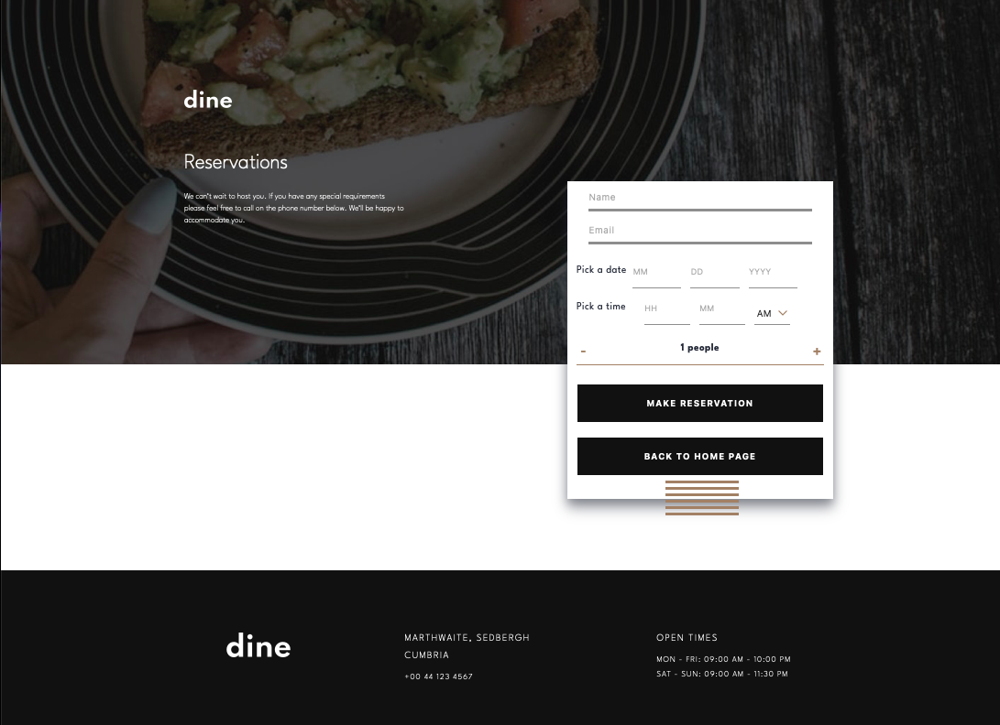

Project : "Restaurant_WebSite"

Installation:
1. npm install
2. npm start

Technologies : react, node, js, scss

Screenshots:

Description:
Fully responsive and functional website. It is an example of a business card for restaurants, pubs and clubs. It allows you to present your place in an interesting way.

Email service :
* EmailJS
